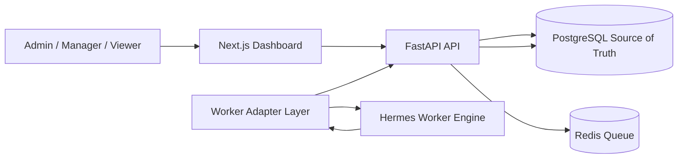

# Voryx AI Operations Platform

Production-oriented MVP control center for companies, AI employees, schedules, jobs, Hermes worker integration, activity logs, notifications, credential vault metadata, and reporting.

Deployed target: `ops.themealz.com`.

## Architecture



The dashboard database is the source of truth. Hermes is only a worker engine and never owns canonical state.

## Quick start

```bash
cp .env.example .env
docker compose up --build
```

Frontend: http://localhost:3000
Backend: http://localhost:8000/docs

Default seeded user is created on first API startup from `FIRST_SUPERUSER_EMAIL` and `FIRST_SUPERUSER_PASSWORD`. Set both values before starting the API.

## Local development

Backend:

```bash
cd backend
python -m venv .venv
. .venv/bin/activate
pip install -r requirements.txt
alembic upgrade head
uvicorn app.main:app --reload
```

Frontend:

```bash
cd frontend
npm install
npm run dev
```

## Environment

See `.env.example` for all variables. Credentials are encrypted with `CREDENTIAL_ENCRYPTION_KEY`; never hardcode provider secrets.

## Hostinger deployment

Browser inventory and integration notes are available in:

* `BROWSER_ACCESS_REPORT.md`
* `docs/hostinger-integration.md`

Production deployment should reuse the existing Hostinger VPS and Hermes Agent. Use `docker-compose.prod.yml` with `.env.production` after confirming the existing Traefik network and Hermes internal endpoint.
